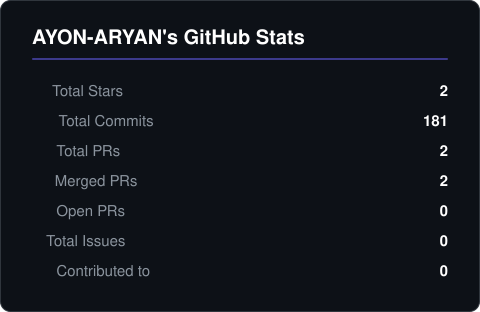

 

# AYON ARYAN

**AI Systems & Backend Engineer · Applied LLM, Hybrid RAG, On-Device ML**

CS Undergrad @ RV University (AI/ML) · Bangalore, India

 

 

 

`🎓 RV University · AI/ML · CGPA 7.8 · Class of 2027`  ·  `💼 2 industry internships shipped`  ·  `🧩 153 LeetCode (83 Med · 19 Hard)`  ·  `🏆 Best Project Award · IEEE CCEM 2024`

 

> I design and ship applied AI systems — local-first LLM pipelines, hybrid retrieval, MCP tool servers, and on-device ML on Apple Silicon. Production systems, not notebooks.

 

---

 

## FOCUS

- **Local-first LLM systems.** Dual-LLM topologies (cloud + on-device fallback), schema-constrained generation, prompt-injection defense, deterministic guardrails for write operations.
- **Hybrid retrieval.** Knowledge graphs (NetworkX) fused with dense vector indexes (FAISS / pgvector) for grounded RAG.
- **Model Context Protocol (MCP).** Building MCP servers that expose tools (DB, travel, web) to LLM clients.
- **On-device ML on Apple Metal.** PyTorch + LightGBM training and inference targeting M-series GPUs via Metal Performance Shaders.
- **Production backends.** Spring Boot · Flask · FastAPI. RBAC, Fernet credential encryption, snapshot-based undo.

 

---

 

## NOW

- **DATABASE-MANAGER** — natural-language to SQL across 8 engines with a dual-LLM safety pipeline.
- **routecraft** — multi-modal transit predictor for Bengaluru on Apple Metal.
- **TRAVEL-PLANNER-MCP** — MCP server exposing planning tools to LLM clients.
- **graph-rag** — hybrid Knowledge Graph + FAISS retrieval over user documents.

 

**Previously:** AI Intern @ Broadrange AI (Chicago) · Android Developer @ Techpuram (Madurai)
**Education:** B.Tech (Hons) CSE @ RV University · AI/ML Major · FinTech Minor · Class of 2027

 

---

 

## STACK

| Layer | Tools |
|:------|:------|
| **Languages** | `Python` `Java` `C++` `Kotlin` `C` `SQL` `Solidity` `JavaScript` |
| **ML / DL** | `PyTorch` `TensorFlow` `Keras` `scikit-learn` `LightGBM` `LangChain` |
| **Inference** | `Ollama` `Groq` `Hugging Face Transformers` `Mistral` `Llama` `BERT` |
| **Retrieval** | `FAISS` `pgvector` `NetworkX` `Chroma` |
| **Backend** | `Spring Boot` `Flask` `FastAPI` `REST` `Microservices` |
| **Mobile** | `Jetpack Compose` `CameraX` `Android SDK` |
| **Data** | `PostgreSQL` `MySQL` `SQLite` `MSSQL` `Oracle` `MongoDB` `Cassandra` `Redis` |
| **Infra** | `Docker` `Git` `Linux` `macOS / Apple Metal` |

 

---

 

## SYSTEMS I'VE BUILT

 

### PROJECT DETAILS

<b>DATABASE-MANAGER — Natural Language to SQL across 8 engines</b>

 

Local AI-powered database management with a **dual-LLM topology**: Groq-hosted Mixtral for high-fidelity generation, Ollama-hosted Mistral as the fully-offline fallback. Same NL prompt → executable query against any of 8 engines: **SQLite, MySQL, PostgreSQL, MSSQL, Oracle, MongoDB, Cassandra, Redis**.

Safety pipeline: schema-aware prompting, AST-level SQL validation, human-in-the-loop review on writes, snapshot + one-click undo, RBAC, Fernet-encrypted credential storage.

`Python` `Groq` `Ollama` `Mistral` `Fernet` `RBAC` `8 DB engines`

<b>routecraft — Multi-modal transit ML for Bengaluru</b>

 

Predicts and routes across **Walk · Auto · Cab · BMTC bus · Metro** using ML-driven traffic priors. LightGBM gradient-boosted regressor for ETA, PyTorch sequence model for live re-estimation. Trained and served on Apple M-series GPUs via Metal Performance Shaders — no CUDA, no cloud GPU.

`Python` `LightGBM` `PyTorch` `Apple Metal` `Geospatial`

<b>graph-rag — Hybrid Knowledge Graph + Vector RAG</b>

 

NetworkX-backed knowledge graph fused with FAISS dense retrieval, synthesised by a Groq-hosted LLM. Document ingestion handles PDF / TXT with intelligent chunking. D3.js force-directed visualisation of the live graph. Flask backend, glassmorphism UI.

`NetworkX` `FAISS` `Groq` `D3.js` `Flask`

<b>LLM-SERVICE-MCP — Autonomous agent on Spring Boot</b>

 

Microservice-based AI agent. BERT intent classifier routes prompts in real-time to one of three downstream services: RAG, Web Search, or Chat. Multi-step reasoning over tool calls. Spring Boot orchestration in Java.

`Spring Boot` `BERT` `RAG` `Microservices` `Intent Classification`

<b>LEGAL-AI-LLM — Built at Broadrange AI, Chicago</b>

 

Legal-domain LLM grounded on curated case-law datasets to minimise hallucination. RAG architecture with document ingestion + chunking. **PromptGuard V2** in front of the model for prompt-injection defense.

`LLM` `RAG` `PromptGuard V2` `Document Ingestion`

<b>Brain-Tumor-Segmentation — Medical imaging</b>

 

U-Net encoder-decoder architecture for semantic segmentation of brain tumors from MRI scans. Built for a Kaggle competition.

`U-Net` `TensorFlow` `Medical Imaging`

<b>Image-Resolution-Enhancer — Real-ESRGAN fine-tune</b>

 

Transfer-learned Real-ESRGAN on paired HR/LR face datasets with custom loss balancing.

| PSNR | SSIM |
|:----:|:----:|
| 29.15 → **33.95 dB** | **0.8985** |

`Real-ESRGAN` `PyTorch` `Transfer Learning` `GANs`

<b>PERSONAL_ASSISTANT — Fully offline voice agent on macOS</b>

 

Siri-style voice assistant for M-series Macs. Local speech recognition, local LLM inference, multi-turn dialogue with session memory, lightweight floating UI. **Zero cloud calls.**

`Speech Recognition` `Local LLM` `macOS` `Python`

<b>GEO_LOCATION_SAVER_APP — Production Android, 100+ Play Store installs</b>

 

Location-tagged image capture with server-side anti-spoof validation against fake GPS sources. Real-time address overlay via Google Maps API.

`Kotlin` `Jetpack Compose` `CameraX` `Google Maps API`

 

<b>MORE PROJECTS</b>

 

| Project | What It Does |
| --- | --- |
| [TRAVEL-PLANNER-MCP](https://github.com/AYON-ARYAN/TRAVEL-PLANNER-MCP) | MCP server exposing trip-planning tools to LLM clients |
| [INTELLI-CHAT-AI](https://github.com/AYON-ARYAN/INTELLI-CHAT-AI) | Smart Document and Web Assistant — RAG + LLM |
| [Blockchain-Voting-System](https://github.com/AYON-ARYAN/Blockchain-Voting-System) | On-chain voting — Solidity smart contracts |
| [Movie_Recommendation_System](https://github.com/AYON-ARYAN/Movie_Recommendation_System) | Moodix — TF-IDF + Cosine Similarity recommender |
| [Currency-Exchange](https://github.com/AYON-ARYAN/Currency-Exchange) | Live FX conversion application |
| [Fake-News-Check](https://github.com/AYON-ARYAN/Fake-News-Check) | Fake news classifier — ML + NLP |
| [Bank_Statement_Organizer](https://github.com/AYON-ARYAN/Bank_Statement_Organizer) | FinTech statement parsing and categorisation |
| [WEATHER_SONG_RECOMMENDATION](https://github.com/AYON-ARYAN/WEATHER_SONG_RECOMMENDATION) | Weather-conditioned song recommender |
| [Print-Quality-Dataset-Generator](https://github.com/AYON-ARYAN/Print-Quality-Dataset-Generator) | Synthetic dataset generation for print-quality CV |
| [DELHI-WEATHER-ANALYSIS](https://github.com/AYON-ARYAN/DELHI-WEATHER-ANALYSIS) | Time-series analysis of Delhi climate data |

 

---

 

## EXPERIENCE

**Artificial Intelligence Intern** — Broadrange AI · Chicago, Illinois
`Jun 2025 — Aug 2025`
Built a legal-domain LLM with RAG retrieval over curated case law. Document ingestion + chunking pipeline. PromptGuard V2 for prompt-injection defense. Reduced hallucination through tight retrieval grounding.

**Android Native Developer** — Techpuram Technology · Madurai, Tamil Nadu
`Feb 2025 — Aug 2025`
Shipped Geo GPS Camera (100+ Play Store installs). Jetpack Compose + Kotlin + Google Maps API. Server-side validation against GPS spoofing.

 

---

 

## EDUCATION

**B.Tech (Hons) Computer Science** — RV University, Bangalore `2023 — 2027`
Major: AI and Machine Learning · Minor: FinTech · CGPA **7.8 / 10**

**Achievements**
- 🏆 **Best Project Award** — Structural Innovation, RV University
- 📄 **IEEE CCEM 2024** — paper presenter (*GlucoSense*: non-invasive saliva glucose biosensor)
- 🧩 **LeetCode** — 116 solved (39 Easy · 64 Medium · 13 Hard)

**Certifications** — AWS (ML Terminology · CLI · DevOps Testing) · IBM SkillsBuild (Big Data, Hadoop, Spark, Kubernetes & OpenShift) · Google Generative AI · NPTEL Programming in Modern C++ · Udemy Spring Boot

 

---

 

## METRICS

<!-- Generated daily by .github/workflows/metrics.yml — accurate counts from the GitHub API, no runtime rate limits -->

&nbsp;

 

---

 

## CONTRIBUTION GRAPH

 

---

### Contribution Snake

---

 

**Local-first. Hybrid retrieval. Production backends.**

LLM systems · MCP servers · On-device ML · Spring Boot · Android

 

**Open to AI/ML · Backend · Android internships — let's build something.**
📫 [ayonaryan5@gmail.com](mailto:ayonaryan5@gmail.com) · [LinkedIn](https://www.linkedin.com/in/ayon-aryan-917078238/)

 

